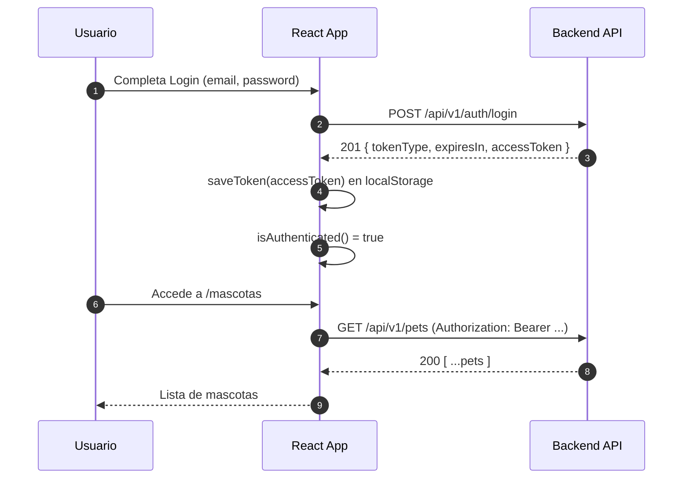
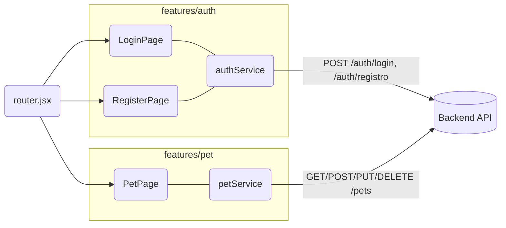

# FitPet Frontend (React + Tailwind v3)

> **Estado:** UI responsive, autenticación conectada al backend y listado de mascotas con filtros y modal de detalle.

accede al Backend aqui 👉 https://github.com/Marisol-Mancera/fitpet-backend

---

## ✅ Descripción

Aplicación **React** que consume la API de **FitPet** para:
- **Registro** y **login** (JWT) con validación granular.
- **Listado de mascotas** con **filtro por especie** y **modal de detalle**.
- Componentes reutilizables (`Button`, `Input`, `ThemeToggle`) y layouts.

**Nota:** Modo oscuro configurado (`darkMode: 'class'`) — pendiente completar clases `dark:` en algunos componentes.

---

## 🧭 Tabla de contenidos
- [Arquitectura y Diagramas](#arquitectura-y-diagramas)
- [Tecnologías](#tecnologías)
- [Instalación y Setup](#instalación-y-setup)
- [Variables de entorno](#variables-de-entorno)
- [Scripts](#scripts)
- [Estructura](#estructura)
- [Integración con Backend](#integración-con-backend)
- [Pruebas](#pruebas)
- [Roadmap UI](#roadmap-ui)
- [Créditos](#créditos)

---

## 🧩 Arquitectura y Diagramas

### Flujo de autenticación (frontend)


### Diagrama de páginas y servicios (simplificado)


---

## 🛠 Tecnologías


---

## 📦 Instalación y Setup

```bash
git clone <tu-repo-frontend>
cd fitpet-frontend
npm install
```

### Tailwind v3 (config)
```js
// tailwind.config.js
export default {
  darkMode: 'class',
  content: ["./index.html", "./src/**/*.{js,jsx,ts,tsx}"],
  theme: {
    extend: {
      colors: {
        'fp-primary': { 500: '#155B6D', 600: '#0F4C5C', 700: '#0B3944' },
        'fp-mint': { 500: '#7AD9C0', 600: '#3CBFA1' },
        'fp-warm': { 500: '#FFC857' },
        'teal': { 100: '#CEEBD1' }
      }
    }
  },
  plugins: []
}
```

---

## 🔑 Variables de entorno

**`.env`**
```bash
VITE_API_BASE_URL=http://localhost:8080/api/v1
```

> Ajusta el origen CORS del backend a `http://localhost:5173`.

---

## 🧰 Scripts

```bash
npm run dev        # desarrollo
npm run build      # build producción
npm run preview    # previsualizar build
npm run test:unit  # tests con Vitest
```

---

## 🗂 Estructura

```
src/
├── app/
│   └── routes/router.jsx
├── features/
│   ├── auth/
│   │   ├── pages/{LoginPage.jsx, RegisterPage.jsx}
│   │   ├── services/authService.js
│   │   └── utils/validation.js
│   ├── pet/
│   │   ├── pages/PetPage.jsx  (listado+filtros+modal)
│   │   └── services/petService.js
│   └── home/pages/HomePage.jsx
├── shared/
│   ├── components/ui/{Button.jsx, Input.jsx, ThemeToggle.jsx, Header.jsx, Footer.jsx}
│   ├── components/auth/PrivateRoute.jsx
│   └── assets/logo.svg
├── index.css
└── main.jsx
```

---

## 🔗 Integración con Backend

- **Base URL:** `http://localhost:8080/api/v1`
- **Auth**
  - `POST /auth/registro` — registro
  - `POST /auth/login` — **201** con `{ tokenType, expiresIn, accessToken }`
- **Pets**
  - `GET /pets` — lista del usuario
  - `GET /pets?species=Dog|Cat|Bird|Other` — filtro
  - `GET /pets/{id}` — detalle
  - `POST /pets` — crear
  - `PUT /pets/{id}` — actualizar
  - `DELETE /pets/{id}` — eliminar

###  `PetPage.jsx` (implementación)
- Carga desde API con `listPets(filtroEspecie)`
- Botones de filtro: **Todas/Perros/Gatos/Aves/Otros**
- **Modal de detalle** con `getPetById(id)`
- El filtro **se mantiene** al cerrar el modal
- Manejo de estados `loading`/`error` + fallback de sesión expirada (redirige a `/login`)

---

## 🧪 Pruebas

- **Vitest + React Testing Library**
- Tests existentes:
  - `RegisterPage.test.jsx` — **8/8** (validación granular )
  - `LoginPage.test.jsx` — **9** 
  - `validation.test.js` — **~25** casos (email/password)
 
```bash
npm run test:unit
```

---

## 🎨 UI

- **Tailwind v3** — sin CSS variables; todo con utilidades.
- Header/ Footer rediseñados (estilo **Margarita**).
- Grid **2×2** asimétrico en Home.
- **Dark mode** con `ThemeToggle` (pendiente agregar `dark:` en todos los componentes).

---

## 🛣 Roadmap UI

- Completar `dark:` en todos los componentes.
- Página **Admin** (perfil/ajustes).
- Formulario **Create/Edit Pet**.
- Estado global (Pinia/Redux/Context) si escala.
- Accesibilidad (focus states, ARIA).

---

## 👩‍💻 Créditos

Frontend: **Marisol Mancera Villarejo**  
**Licencia/Disclaimer:** Proyecto académico, uso educativo, sin garantías.

